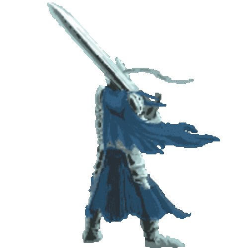

  

# Bonjour, je suis Lucas 👋

Je suis étudiant en BUT Informatique à l'IUT Robert Schuman.  

Passionné par le monde vidéoludique depuis tout petit, je poursuis mon rêve de devenir développeur indépendant de jeux vidéos.

# 🛠️ Mes compétences

**Les languages avec lesquels je travaille**

  

**Les outils que j'utilise**

  

# 🗂️ Mes projets

## 🏃 Projet personnel : Rungame

Un petit projet personnel pour expérimenter sur Godot.  
Incarnez un petit personnage qui court et saute à travers des obstacles générés aléatoirement.

Le jeu n'est pas fini, j'ai plusieurs idées de mise à jour à venir :

- Augmentation de la taille du contenu :
  - plus de skins (13 terminés / 28 prévus actuellement)
  - plus de sections de niveaux (10 terminées / ~100 voulues)
  - plus de cartes d'améliorations (35 terminées / 35 prévues actuellement)
  
- Ajout d'une Jukebox pour laisser au joueur le choix complet de sa playlist en jeu

- Ajout d'un mode multijoueur en LAN

- Ajout de contrôles manettes, avec une interface complètement adaptée à ce support et un menu de configuration des touches

- Refonte des menus

- Intégration d'effets sonores et musiques faits par moi-même (actuellement tous les sons proviennent d'Internet)

**Technologie utilisée** : Godot

## 💀 Projet personnel : WOH Mod Maker

Gestionnaire et outil de création de mods pour le jeu World Of Horror.  
L'application permet à l'heure actuelle de créer des mods de type Event.

Futures fonctionnalités :
- Menu principal affichant les mods créés et un moyen de les éditer
- Outil de création de mods de types Character, Enemy, Mysteries

**Technologie utilisée** : Visual Studio (C#)

## ❄️ Projet universitaire : Polar Extreme

Jeu de gestion d'une base polaire avec des mécaniques s'apparentant à *Rimworld*.

- Gestion d'une base polaire passant par
  - Construction / amélioration de bâtiments
  - Engagement de scientifiques (pnjs) permettant l'exploitation de ces bâtiments
  - Construction de chemins permettant de relier ces batîments et d'y conduire les scientifiques
- Production d'une monnaie / score appelée *Science* via la construction et la gestion de bâtiments
- Limite de temps avec score final

**Technologie utilisée** : Godot

## 🐉 Projet universitaire : Doonjons & Dragons

Jeu à la sauce Donjons & Dragons.  
Le jeu se joue en console et propose un système de création de personnages, de monstres, d'une carte de jeu, et d'un système de combat tour par tour s'inspirant énormément du système de combat dans Donjons et Dragons

**Technologie utilisée** : Java, InteliJ IDEA

## 🎲 Projet universitaire : 2048 en C

Le célèbre jeu 2048 réécrit en C et jouable directement dans le terminal !

**Technologie utilisée** : C, Visual Studio Code

# 📫 Comment me contacter ?
**Email** : lucas.courseaux@etu.unistra.fr

**Discord** : losscann

<!--
**lcourseaux0202/lcourseaux0202** is a ✨ _special_ ✨ repository because its `README.md` (this file) appears on your GitHub profile.

Here are some ideas to get you started:

- 🔭 I’m currently working on ...
- 🌱 I’m currently learning ...
- 👯 I’m looking to collaborate on ...
- 🤔 I’m looking for help with ...
- 💬 Ask me about ...
- 📫 How to reach me: ...
- 😄 Pronouns: ...
- ⚡ Fun fact: ...
-->
